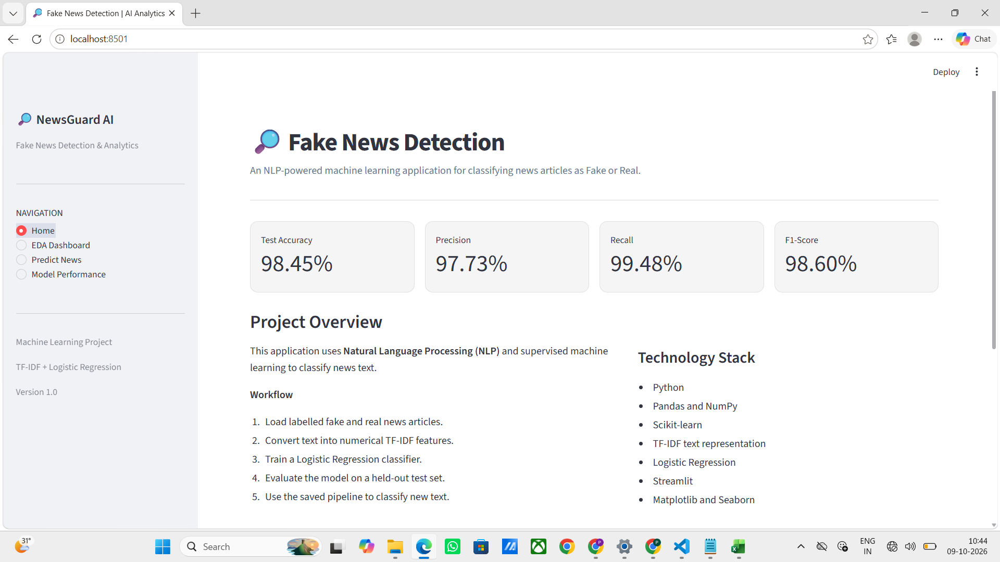
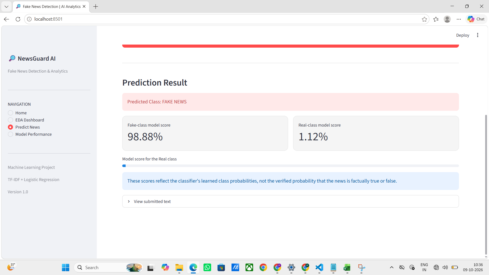
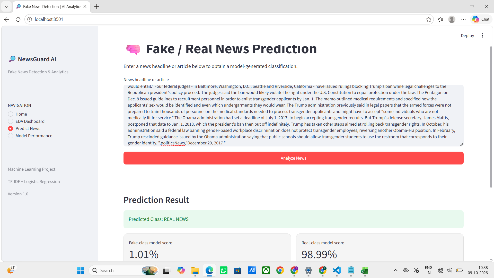
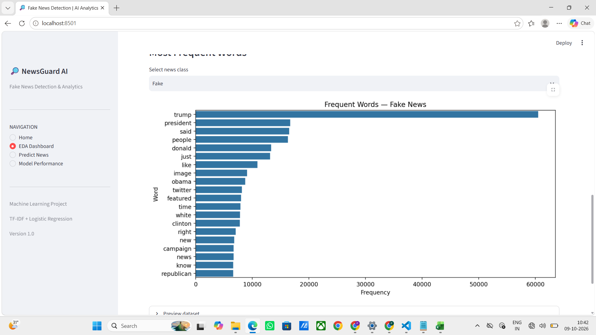
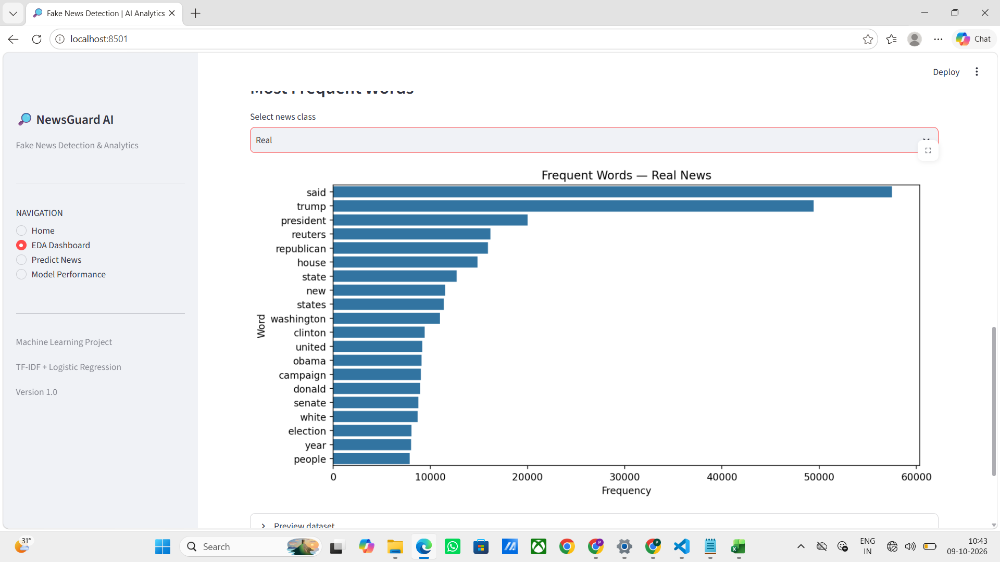
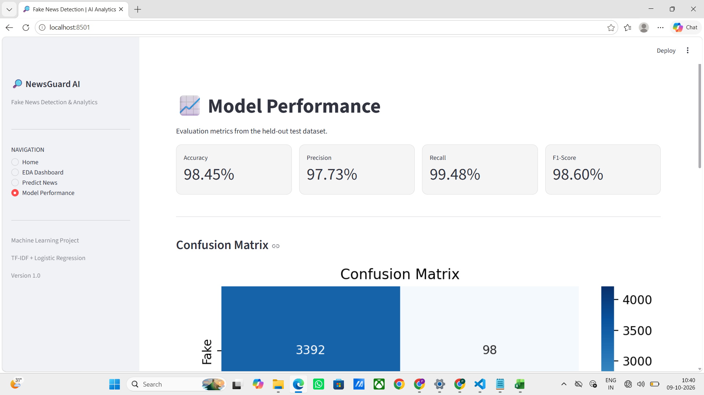

# 📰 Fake News Detection System

An NLP and Machine Learning web application that analyses news text and predicts whether it is potentially **Fake or Real**. Built using Python, Scikit-learn, and Streamlit, this project demonstrates a practical application of machine learning for news text classification.

## 🚀 Live Demo

🔗 **Try the Application:** [Fake News Detection System](https://fake-news-detection-takebl2dwrkz4h2dba45f2.streamlit.app/)

## 📌 Project Overview

The spread of misleading information online makes it important to analyse news content critically. This project uses a trained machine learning pipeline to classify user-provided news text into predicted categories.

Users can enter a news headline or article and receive a prediction through an interactive web interface.

> **Disclaimer:** Predictions are model estimates and do not independently verify the factual accuracy of a news article. Always verify important claims using reliable sources.

## ✨ Key Features

- 📰 **Fake News Prediction** — Predicts whether news text belongs to the Fake or Real class.
- 🎯 **Confidence Score** — Displays the model's estimated confidence when supported.
- 📊 **Exploratory Data Analysis (EDA)** — Visualises dataset distributions and article statistics when datasets are available.
- 📈 **Model Performance Dashboard** — Displays available evaluation metrics, including Accuracy, Precision, Recall, and F1 Score.
- 🌐 **Interactive Web Interface** — User-friendly application built with Streamlit.
- ☁️ **Cloud Deployment** — Accessible online through Streamlit Community Cloud.

## 🖼️ Application Screenshots

### 🏠 Home Page



### 📰 Fake News Detection


### 🔍 Fake News Prediction



### ✅ Real News Prediction



### 📊 Exploratory Data Analysis

#### Overall EDA Dashboard


#### Fake News Analysis



#### Real News Analysis



### 📈 Model Performance



> **Screenshot setup:** Upload all eight PNG files to the same GitHub folder as this `README.md` so the images render correctly.

## 🛠️ Technologies Used

| Technology | Purpose |
|---|---|
| Python | Core programming language |
| Pandas | Data processing and analysis |
| Scikit-learn | Machine learning and model evaluation |
| NLP | News text processing and classification |
| Joblib | Saving and loading the trained model |
| Streamlit | Interactive web application |
| Git and GitHub | Version control and project hosting |

## ⚙️ Machine Learning Workflow

1. **Data Collection:** Obtain labelled fake and real news articles.
2. **Data Preprocessing:** Prepare text for machine learning.
3. **Feature Extraction:** Convert text into numerical features using the configured NLP pipeline.
4. **Model Training:** Train a classifier using labelled news data.
5. **Model Evaluation:** Evaluate the model using standard classification metrics.
6. **Prediction:** Process user-provided news text and predict its class.
7. **Deployment:** Serve the trained model through Streamlit Community Cloud.

## 📊 Model Evaluation Metrics

The project uses standard classification metrics to evaluate model performance.

- **Accuracy:** Overall proportion of correct predictions.
- **Precision:** Proportion of predicted positive cases that are correct.
- **Recall:** Proportion of actual positive cases correctly identified.
- **F1 Score:** Harmonic mean of Precision and Recall.

Actual metric values are available in the application's Model Performance page when the metrics file is present.

## 📁 Project Structure

```text
fake-news-detection/
│
├── app.py
├── train_model.py
├── requirements.txt
├── README.md
│
├── models/
│   ├── news_model.pkl
│   └── metrics.json
│
├── data/
│   ├── Fake.csv
│   └── True.csv
│
├── home.png
├── fake_news.png
├── fake_news_prediction.png
├── true_news_prediction.png
├── EDA.png
├── EDA_fake.png
├── EDA_real.png
└── model_performance.png
```

*Note: The CSV files are needed for the complete dataset-based EDA dashboard. The prediction page can operate without these files if the trained model is available. Large datasets do not have to be committed to GitHub when the application is configured to handle missing datasets.*

## 💻 Installation and Setup

### 1. Clone the Repository

```bash
git clone https://github.com/priyadharshini2002-source/fake-news-detection.git
```

### 2. Navigate to the Project Directory

```bash
cd fake-news-detection
```

### 3. Install Dependencies

```bash
pip install -r requirements.txt
```

### 4. Run the Application

```bash
streamlit run app.py
```

Open the local URL displayed in the terminal to use the application.

## 🔍 How to Use

1. Open the [live application](https://fake-news-detection-takebl2dwrkz4h2dba45f2.streamlit.app/).
2. Navigate to **Predict News**.
3. Enter a news headline or article.
4. Click **Analyse News**.
5. Review the predicted class and available confidence score.
6. Visit **EDA Dashboard** to explore the dataset when available.
7. Visit **Model Performance** to review the saved evaluation metrics.

## 🎯 Project Objectives

- Apply NLP techniques to news text classification.
- Develop a machine learning-based news classification application.
- Evaluate model performance using standard metrics.
- Build and deploy an interactive web application.
- Demonstrate a practical AI application for analysing online information.

## 🔮 Future Enhancements

- Integrate trusted news sources and fact-checking APIs.
- Add explainable AI to identify influential text features.
- Improve robustness against unseen topics and misleading headlines.
- Extend the system to support multilingual news analysis.
- Implement continuous model evaluation and monitoring.

## ⚠️ Limitations

The system predicts labels based on patterns learned during training. It may misclassify satire, breaking news, unfamiliar topics, or carefully written misinformation. Predictions should not be treated as proof of truth or falsehood.

## 👩‍💻 Author

**Priyadharshini S.**

MSc Data Science | Machine Learning | Natural Language Processing | Data Analytics

## 📄 License

This project is intended for educational and portfolio purposes. Add a `LICENSE` file if you wish to define how others may use, modify, and distribute the project.
